# red-pern-project-client README Notes

## Features:

### Heroku Deployment: https://pmb-red-pern-project-client.herokuapp.com/

Version 1.0, 2020-10-13

- Client built using TypeScript and Legacy React (No hooks - useEffect, useState ...) that is the front end for red-pern-project-server
- Together, the server and client form a travel planning app that allows the user to save destinations found using a search calling the OpenTripMap API.
- Destinations may be assigned into one trip, allowing the trip to be a collection of destinations.
- Admin and user roles are represented on the front end: when logged in, a typical user goes to the user login view, and an admin goes to the admin login view
- Admin may edit and delete users, including user roles (ability to assign another user to 'admin' status)
- A user may only edit own trips and destinations.
- Destinations may be marked as favorite and given a rating.
- A trip's collection of destinations may be viewed from the trip table
- Styling: material-ui, Radium, css
- For the typical user, CRUD is possible for destinations and trips
- Trips may be a collection of destinations, determined by a trip's one-to-many association with destinations.
- Form validation
  - Required entries, relevant inputs with required fields marked by '\*'
  - Email must match email format
  - Password checks for: one uppercase, one lowercase, one number, eight-character length minimum
- Rerouting (react-router-dom): the app reroutes the admin/user to the appropriate home page when logging in, or to the login/register page when logging out

 

# Getting Started

### 1. Create a user

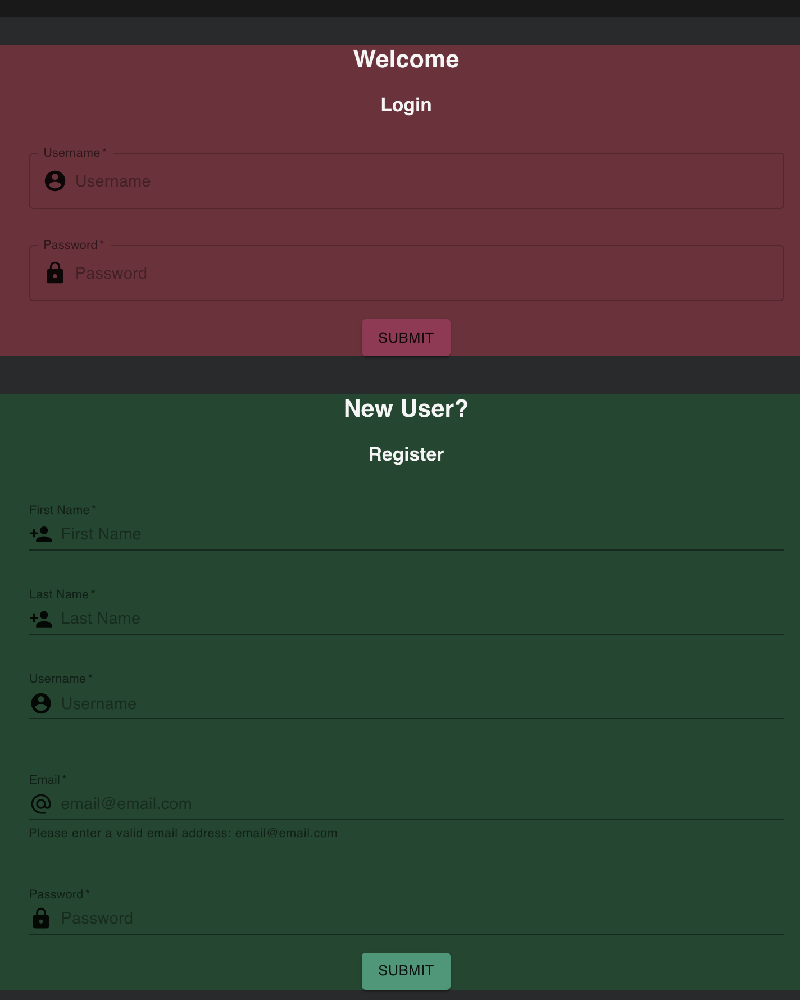

 

### 2. Navigate to the destination page (the pin location icon in the navbar).

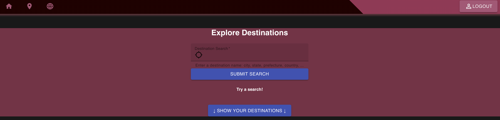

 

### 3. Search for a desired destination in the search bar.

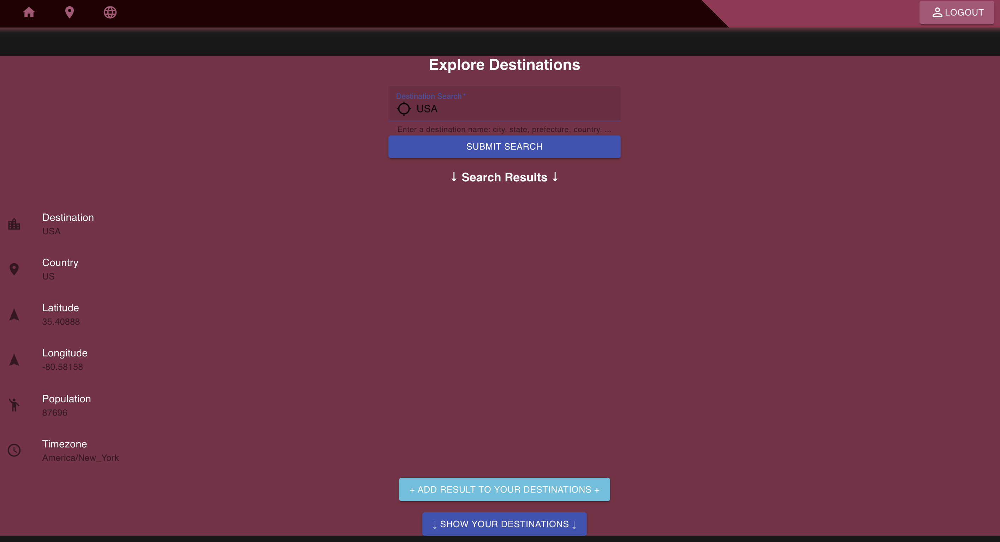

 

### 4. The destination that pops up in the search result may be added with the '+ ADD RESULT TO YOUR DESTINATIONS +' button, which will populate in the table below.

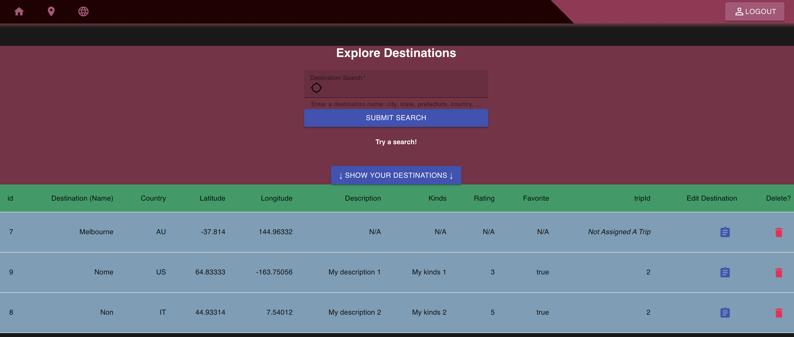

 

### 5. To create a trip, navigate to the trip page (the globe icon in the navbar) and click on the +CREATE NEW TRIP+ button.

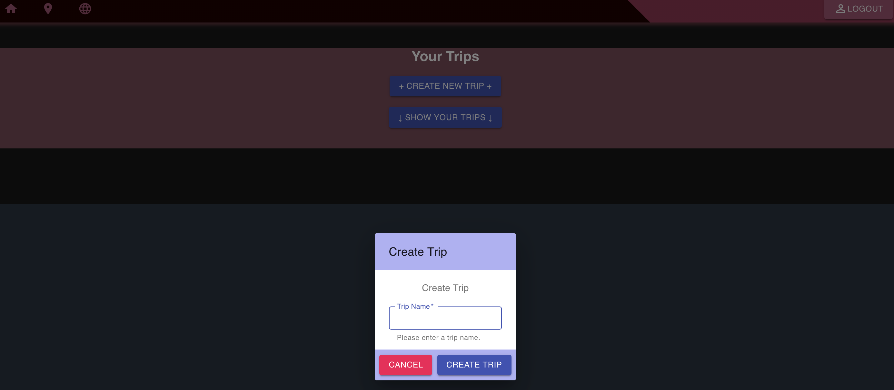

 

### 6. If desired, saved destinations may be added to a trip by using the edit destination button in the saved destinations table. To add a trip, use the Trip Assignment menu field.

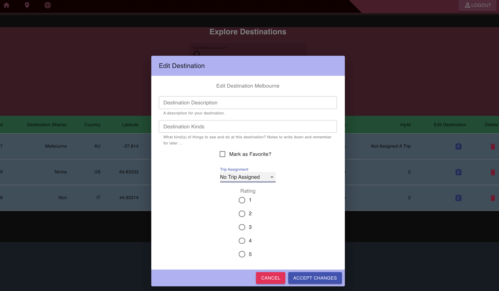

 

### 7. To view a trip's destination collection, click on a trip's 'Destination Info' button in the trip table. Like destinations, trips may also be edited on the trips table.

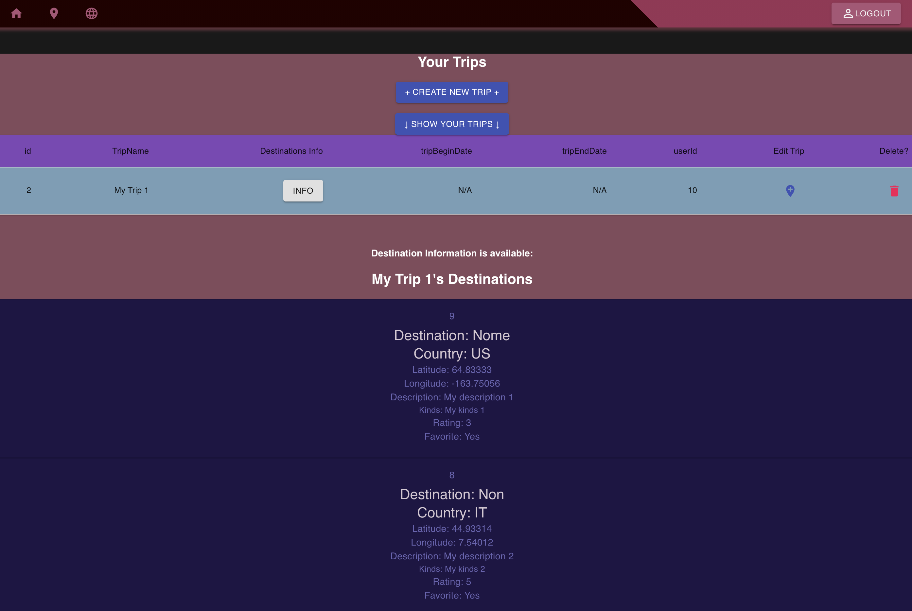

 

### 8. Once trips and/or destinations are created, a general overview of the current user's information is available at the user's home view (the house icon in the navbar).

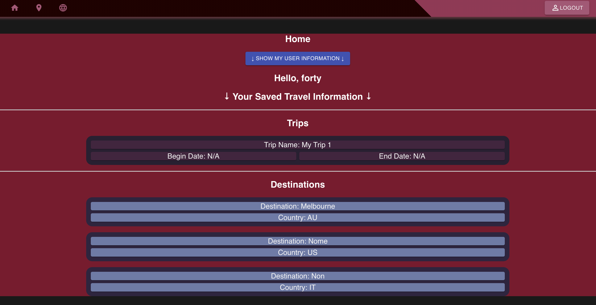

 

# For Future Versions (Client)

- Enhanced validation and handling of forms
- Advanced styling, explore more possibilities with material-ui / radium
- Clean up inefficient code, take out unnecessary code
- Expand functionality -> more API calls, more ways to edit/update destinations/trips
- Table sort functionality
- Expanded admin role -> full CRUD capabilities for all tables
- A catchy name for the app
- Styling - attractive pictures, slideshows of destinations, etc.
- Map view for selecting coordinates and showing the destination

 

# red-pern-project-server README Notes

## Features:

Version 1.0, 2020-10-13

- Server built using Node.js and PostgreSQL that is the back end for the red-pern-project-client
- Together, the two form a travel planning app that allows the user to save destinations found using a search calling the OpenTripMap API.
- Destinations may be assigned into one trip, allowing the trip to be a collection of destinations.
- The admin role establishes certain permissions the user does not have access to, such as editing and deleting other users, including altering user roles from 'user' to 'admin'.
- The back end, red-pern-project-server, is built with js while the front end, erd-pern-project-client, is built in TypeScript.
- Tables: user, trips, destinations
  - Users
  - Destinations
  - Trips
- DB associations
  - Users own destinations and trips
  - Destinations can belong to a trip
- CRUD is possible for the user on the destinations and trips tables
- Deployed on Heroku along with the server side

 

### For Future Versions (Server)

- Expanded user/admin role privileges
- More calls from the OpenTripMap API or others with more advanced searching options
- Explore other data types and functions of Sequelize/PostgreSQL that may improve the app
- Back end validation
- Rewrite inefficient code/cut down on unnecessary code

 

### Resources

- https://bezkoder.com/sequelize-associate-one-to-many/
- https://medium.com/@tonyangelo9707/many-to-many-associations-using-sequelize-941f0b6ac102
- https://medium.com/@eth3rnit3/sequelize-relationships-ultimate-guide-f26801a75554
- https://codehandbook.org/implement-has-many-association-in-sequelize/
- https://grokonez.com/node-js/sequelize-many-to-many-association-nodejs-express-mysql
- https://bezkoder.com/sequelize-associate-many-to-many/

 

# Feedback

This is still very much a work in progress! I appreciate any suggestions and constructive criticisms. As this app evolves, I hope to continue learning and refining my development skills.

 

# User Endpoints Sample in Postman

### Admin username20 Register

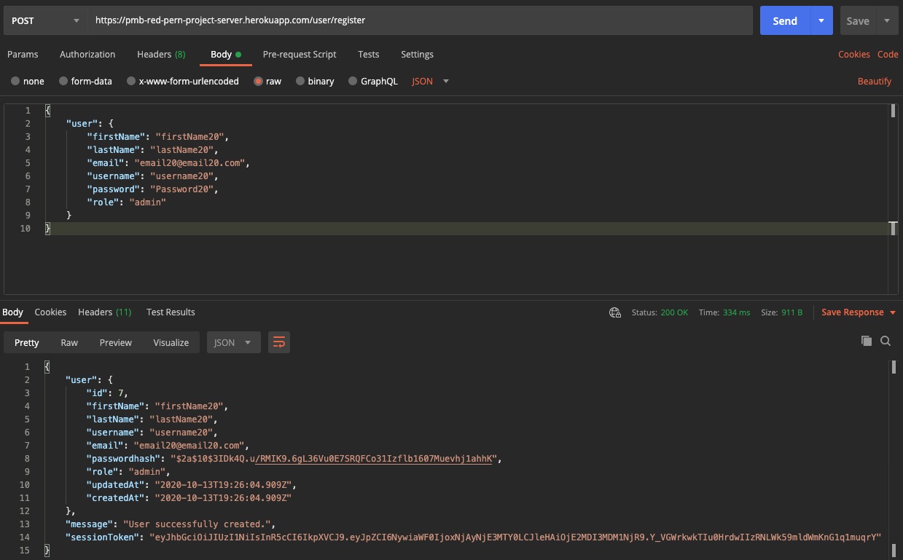

### Admin username20 Login

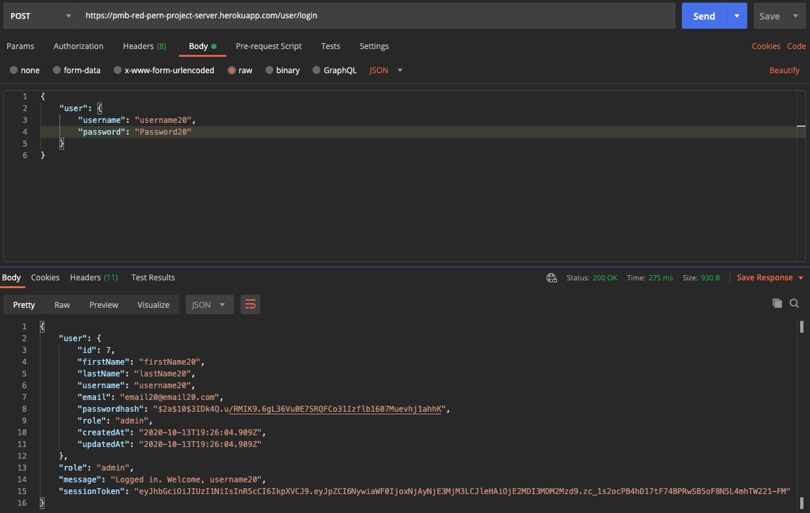

### User username22 Register

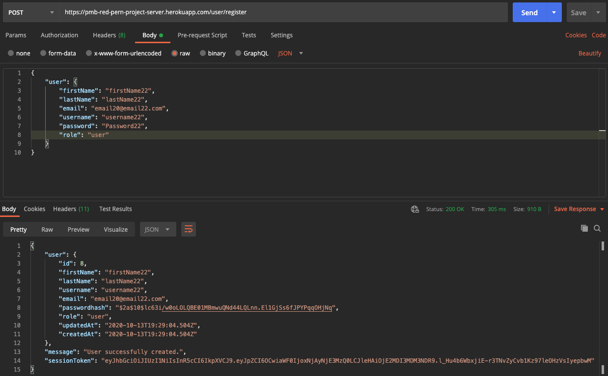

### User username22 Login

### User username22 Edit

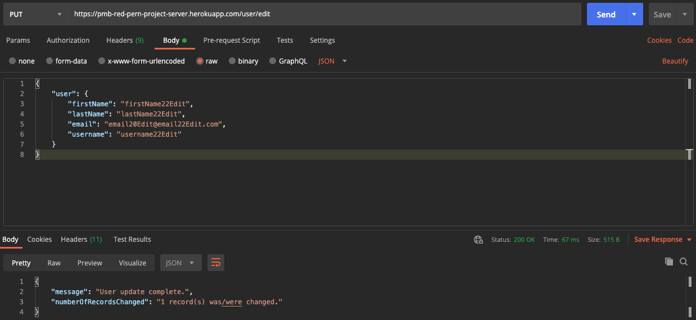

### User username22 Delete

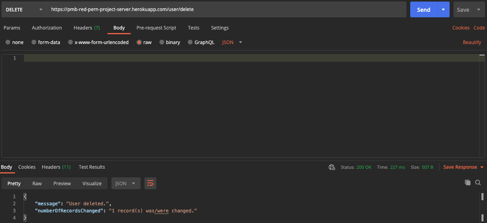

 

# Original README Notes (Client, React):

This project was bootstrapped with [Create React App](https://github.com/facebook/create-react-app).

## Available Scripts

In the project directory, you can run:

### `npm start`

Runs the app in the development mode. 
Open [http://localhost:3000](http://localhost:3000) to view it in the browser.

The page will reload if you make edits. 
You will also see any lint errors in the console.

### `npm test`

Launches the test runner in the interactive watch mode. 
See the section about [running tests](https://facebook.github.io/create-react-app/docs/running-tests) for more information.

### `npm run build`

Builds the app for production to the `build` folder. 
It correctly bundles React in production mode and optimizes the build for the best performance.

The build is minified and the filenames include the hashes. 
Your app is ready to be deployed!

See the section about [deployment](https://facebook.github.io/create-react-app/docs/deployment) for more information.

### `npm run eject`

**Note: this is a one-way operation. Once you `eject`, you can’t go back!**

If you aren’t satisfied with the build tool and configuration choices, you can `eject` at any time. This command will remove the single build dependency from your project.

Instead, it will copy all the configuration files and the transitive dependencies (webpack, Babel, ESLint, etc) right into your project so you have full control over them. All of the commands except `eject` will still work, but they will point to the copied scripts so you can tweak them. At this point you’re on your own.

You don’t have to ever use `eject`. The curated feature set is suitable for small and middle deployments, and you shouldn’t feel obligated to use this feature. However we understand that this tool wouldn’t be useful if you couldn’t customize it when you are ready for it.

## Learn More

You can learn more in the [Create React App documentation](https://facebook.github.io/create-react-app/docs/getting-started).

To learn React, check out the [React documentation](https://reactjs.org/).
